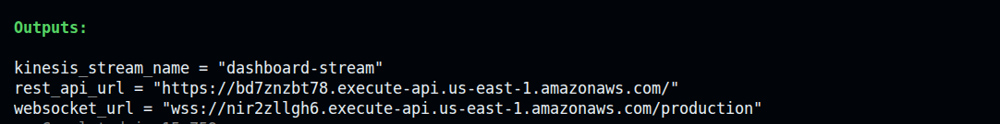

# 🚀 Deploying the Real-Time Streaming Dashboard with Terraform

This guide provisions the entire pipeline — Kinesis Data Stream, DynamoDB tables, four Lambda functions, WebSocket API Gateway, and REST API Gateway — with a single `terraform apply`.

---

## ✅ Prerequisites

- [AWS CLI](https://docs.aws.amazon.com/cli/latest/userguide/getting-started-install.html) installed and configured
- [Terraform](https://developer.hashicorp.com/terraform/install) installed
- Python 3 + `boto3` installed locally (for running the producer script)

### Configure AWS CLI

```bash
aws configure
```

Provide your Access Key ID, Secret Access Key, region (e.g., `us-east-1`), and output format (`json`).

---

## 📁 File Structure

```
terraform/
├── providers.tf          # AWS provider + Terraform version
├── variables.tf          # aws_region
├── dynamodb.tf           # connections + stream-state tables
├── kinesis.tf            # dashboard-stream (on-demand)
├── iam.tf                # 4 Lambda roles with least-privilege policies
├── lambda.tf             # 4 Lambda functions + Kinesis event source mapping
├── api_gateway.tf        # WebSocket API (dashboard-ws) + REST HTTP API (dashboard-rest)
├── outputs.tf            # websocket_url, rest_api_url, kinesis_stream_name
├── terraform.tfvars.example
└── lambda/
    ├── ws_connect.py / ws_connect.zip
    ├── ws_disconnect.py / ws_disconnect.zip
    ├── stream_processor.py / stream_processor.zip
    └── get_state.py / get_state.zip
```

---

## 🚀 Deployment Steps

### 1. Navigate to the Terraform directory

```bash
cd terraform
```

### 2. Set your variables

```bash
cp terraform.tfvars.example terraform.tfvars
```

Edit `terraform.tfvars`:

```hcl
aws_region = "us-east-1"
```

### 3. Initialize Terraform

```bash
terraform init
```

### 4. Plan

```bash
terraform plan
```

Review what will be created — 2 DynamoDB tables, 1 Kinesis stream, 4 Lambda functions, 4 IAM roles, 2 API Gateways, and supporting resources.

### 5. Apply

```bash
terraform apply
```

Type `yes` when prompted. Takes ~30 seconds.

Outputs:
```
kinesis_stream_name = "dashboard-stream"
rest_api_url        = "https://<id>.execute-api.us-east-1.amazonaws.com"
websocket_url       = "wss://<id>.execute-api.us-east-1.amazonaws.com/production"
```



---

## ✅ Testing the Pipeline

### Configure the frontend

Open `frontend/dashboard.html` and set the two config values at the top of the `<script>` block:

```javascript
const WS_URL   = '<websocket_url from terraform output>';
const REST_URL = '<rest_api_url from terraform output>/state';
```

Open the file in your browser. The status indicator should turn green and show **Live**.

### Run the producer script

Update `producer.py` in the project root — set `region_name` to match your region:

```python
kinesis = boto3.client('kinesis', region_name='us-east-1')
```

Then run it:

```bash
pip install boto3
python producer.py
```

The producer simulates a lunch rush — each tick (1 second) bursts 2–4 new orders simultaneously and advances all active orders through `NEW → PREPARING → READY`. Events are sent in batches via `put_records`, so each Kinesis invocation carries multiple records and the Lambda batch of 10 fills naturally. Runs for ~90 seconds.

### Watch the dashboard

New orders appear in the **NEW** column the moment the producer sends them. Status changes move cards between columns in real time — no refresh needed.

### Test the REST endpoint directly

```bash
curl <rest_api_url>/state | python3 -m json.tool
```

Expected response:
```json
[
  {
    "entity_id": "ORD-A3F9C1",
    "table_no": "T7",
    "items": ["Butter Chicken", "Naan"],
    "status": "PREPARING",
    "placed_at": "2026-04-26T12:34:00Z",
    "last_updated": "2026-04-26T12:35:10Z"
  }
]
```

### Verify each step

| What to check | Where |
|---|---|
| Kinesis receiving events | Kinesis → `dashboard-stream` → Monitoring tab |
| Lambda processing | CloudWatch → Log Groups → `/aws/lambda/stream-processor` |
| Orders in DynamoDB | DynamoDB → `stream-state` → Explore items |
| Connections tracked | DynamoDB → `connections` → Explore items |
| WebSocket push working | Dashboard updates live as producer runs |

---

## 🔥 Cleanup

```bash
terraform destroy --auto-approve
```

This removes all provisioned resources. One thing is **not** managed by Terraform and must be deleted manually:

- **CloudWatch Log Groups** — created automatically by Lambda at runtime; go to CloudWatch → Log Groups → delete `/aws/lambda/ws-connect`, `/aws/lambda/ws-disconnect`, `/aws/lambda/stream-processor`, `/aws/lambda/get-state`
